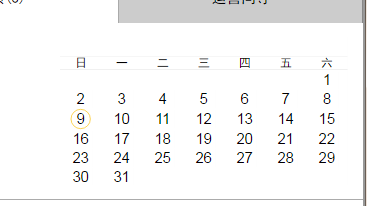

# calendar-js
可以绘制html日历,可以进行农历计算,可以运行于各种浏览器
源文件注释。
##### 注意：
以下方法可查看源文件，里面有方法(函数)的参数和返回数据的详细注解。

### 展示
<p>
    
</p>

### 绘制日历表格 日历月份切换需要左右滑动，左滑则是进入上一个月，右滑则是进入下一个月 可查看源文件，有详细注释
使用时引入calendar.css和calendar.js
（注意：在appcan内使用需要引入appcan.js；
在其他地方（如网页）需引入jquery.js）；<br>
若不引入appcan.js（或jquery.js）将没有左右滑动进行月份切换。<br><br>
CalendarHtml.drawCalendar(tag);//绘制日历，tag为标签id <br>
CalendarHtml.clickDate(timetamp);//点击日历回调函数，日期选中后回调函数，timetamp为回传参数，时间戳;<br>
CalendarHtml.weekChinese(tag);//周几的数字转化成中文<br>
例子：
```
<link rel="stylesheet" href="./calendar/calendar.css">
<script src="./.../calendar-js/calendar/calendar.js"></script>
<div id="dv"></div>

<script>
CalendarHtml.drawCalendar("dv");
CalendarHtml.clickDate = function(timetamp){
};
</script>
```
### 农历模块操作 可以进行农历计算 可计算本月/本年的天数 可查看源文件，有详细注释
引入calendarChinese
CalendarChinese.getChineseDate();//获取农历年月日及节假日 具体参数请查看文件中的注释，
```
<script src="./calendarChinese/calendarChinese.js"></script>
<script>
CalendarChinese.getChineseDate(new Date().getTime());
</script>
```

### [我的博客](http://blog.sina.com.cn/s/articlelist_6078695441_0_1.html)
